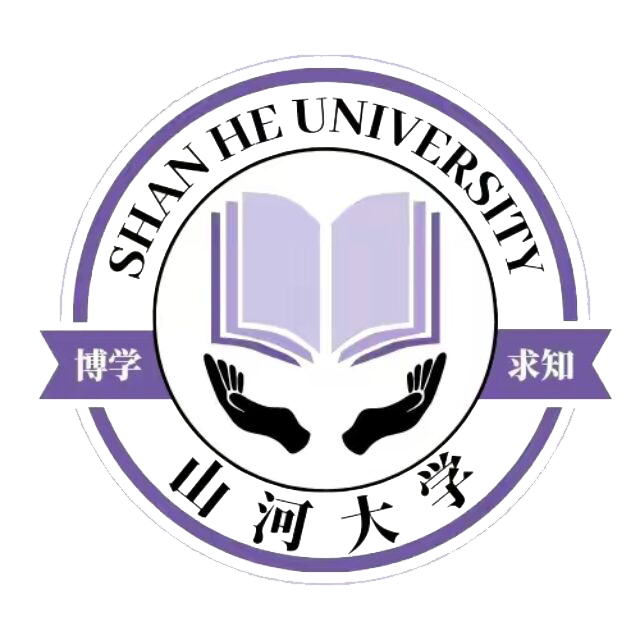

# :rainbow: shanhe_university

		

​		山河大学（SHANHE University）,坐落于虚拟世界山河四省交界处，系山河四省直属的重点大学，第一所元宇宙高等学府，唯一入选“114工程”、“514工程”的院校，拥有一体化自主成才培养体系和科学研究技术交流中心，学子科学研究技术的基地，被誉为“全年龄人才的摇篮”“中原人才培训基地”，“梦想实现基地”“见习单位”。
山河大学，山东山西谓之山，河南河北谓之河，兼爱大成谓之大，博学求知谓之学，是第一所由山河四省学子自主创办的虚拟性综合性大学。创立于2023年6月28日，创办之初，立即引起社会千万学子广泛关注。
据2023年6月学校官网显示，学校目前为虚拟学校，采取线上授学，学子自主上课。学校设有工，理，农，医，经，管，艺术，教育，哲学，文，史，法，等13门类大学科以及诺干新兴学院系如魔法学院、玄学院等。我校采用无师管理模式，下设院长一名副院长多名，老师采用聘请制（聘请学生或者社会人士）；鼓励学子自主学习感兴趣的学科，帮助学子发现自己的闪光点，让学子发现美，创造美，为社会做出更大的贡献。

​		山河大学名誉校长杜甫，名誉教授老子，孔子，墨子，韩非子，荀子，管仲，贾思勰，白居易，嬴政，王维，商鞅，魏征，霍去病，孙子，孙武，孙膑，子路，韩信，白起，鲁班，岳飞，柳宗元，王昌龄等等所有山河四省户籍名人（排名不分先后）
创立以来，山河大学始终与山河四省的学子共命运，与时代和社会共同前进。        

# :bell:校训

# :wind_chime:校风

# :school:学院介绍

## 表演艺术

## 电商传媒

## 计算机

## 医学部

## 城市轨道交通

## 玄学院

## 农业机械

## 生物工程

---

# :video_game:社团介绍

## 山河游戏社团

## 宣传部

## 二次元

## 南通社

# :art:多彩生活

### 食堂

